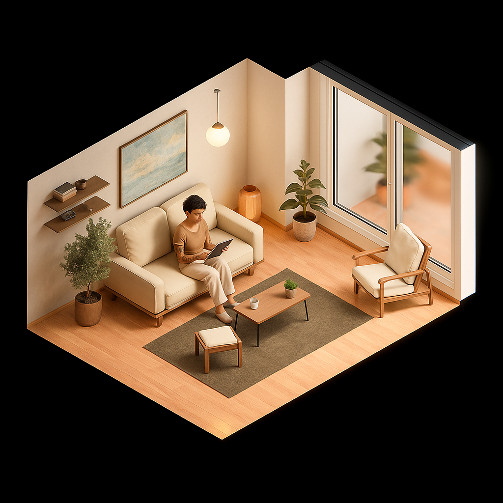

# PREMIUM 3D AI ANIMATION PROPERTY MARKETING
## For Luxury Properties EUR 1M+

# **TRANSFORM LUXURY PROPERTIES INTO EMOTIONAL EXPERIENCES**

## **Stop Showing Empty Rooms.**
## **Start Showing Future Lifestyles.**

### The World's First AI-Powered 3D Animation Service for Premium Real Estate

**✓ Photorealistic 3D Staging & Interior Design**  
**✓ AI Characters Demonstrating Luxury Living**  
**✓ Cinematic 10-60 Second Marketing Videos**  
**✓ Demographic-Targeted Lifestyle Scenarios**

*Exclusively for properties valued EUR 1M and above*

---

### **THE LUXURY PROPERTY CHALLENGE**

High-end buyers don't just purchase properties—they invest in lifestyles. Traditional photography fails to convey the luxury experience. Empty rooms, no matter how beautiful, cannot communicate the emotional value of a EUR 1M+ investment.

**Your premium listings deserve premium marketing.**

### **THE SOLUTION: AI-POWERED LUXURY VISUALIZATION**

Transform architectural plans into cinematic experiences that showcase not just the space, but the lifestyle it enables. Our AI characters demonstrate how sophisticated buyers will actually live in these premium properties.

---

## **COMPLETE LUXURY MARKETING PACKAGE INCLUDES:**

### 🏗️ **Architectural Floorplan Transformation**
- Convert basic plans into stunning visual presentations
- Luxury-focused design with premium finishes
- Multiple format outputs for high-end marketing channels
- Professional measurements and spatial flow visualization

### 🏠 **Premium 3D Virtual Staging**
- Photorealistic 3D models with luxury furnishings
- High-end interior design by professional stylists
- Multiple luxury styles: Contemporary, Classic, Minimalist, Maximalist
- Premium materials, lighting, and texture rendering

### 🎬 **Cinematic AI Character Animations**
- 10-60 second luxury lifestyle demonstrations
- Multiple camera angles showcasing key premium features
- Professional cinematography with smooth transitions
- Highlight luxury amenities: wine cellars, home theaters, spa bathrooms

### 👥 **Luxury Demographic Targeting**
- **Executive Professionals:** C-suite lifestyle demonstrations
- **Affluent Families:** Luxury family living scenarios
- **Empty Nesters:** Sophisticated mature couple lifestyle
- **International Buyers:** Culturally appropriate character selection
- **Lifestyle Customization:** Art collectors, wine enthusiasts, fitness-focused

### 🌅 **Premium Day/Night Rendering**
- **Golden Hour:** Warm, luxurious natural lighting
- **Evening Ambiance:** Sophisticated interior lighting design
- **Seasonal Variations:** Summer entertaining, winter coziness
- **Mood Customization:** Intimate dinners, grand entertaining

---

## **PREMIUM PACKAGE PRICING**
*Exclusively for Properties EUR 1M+*

### **LUXURY APARTMENT** - €2,500
**Perfect for:** Premium apartments, penthouses, luxury condos
- 2-4 room premium 3D staging
- 30-45 second cinematic animation
- 3 luxury demographic scenarios
- Day AND evening rendering
- Luxury lifestyle focus
- **Delivery:** 3-5 days

### **LUXURY VILLA** - €3,500
**Perfect for:** Luxury homes, villas, premium single-family properties
- 4-6 room premium 3D staging
- 45-60 second cinematic animation
- 4 luxury demographic scenarios
- Multiple time-of-day renderings
- Outdoor living integration
- Premium amenity showcasing
- **Delivery:** 5-7 days

### **LUXURY ESTATE** - €4,500
**Perfect for:** Estates, mansions, ultra-luxury properties
- 6+ room premium 3D staging
- 60+ second cinematic experience
- Unlimited demographic customization
- Multiple seasonal/time renderings
- Luxury amenity focus (pools, wine cellars, theaters)
- Custom lifestyle scenarios
- **Delivery:** 7-10 days

### **COMMERCIAL LUXURY** - €5,500+
**Perfect for:** Luxury offices, high-end retail, premium hospitality
- Custom 3D modeling and luxury staging
- Business luxury scenarios
- Executive and client-focused demonstrations
- Multiple use-case presentations
- **Delivery:** 10-14 days

### **ULTRA-LUXURY PORTFOLIO** - Custom Quote
**Perfect for:** EUR 5M+ properties, historic estates, unique luxury properties
- Bespoke 3D visualization
- Custom character development
- Multiple property showcasing
- Luxury brand integration
- **Delivery:** 2-4 weeks

---

## **WHY LUXURY BUYERS CHOOSE PROPERTIES WITH OUR ANIMATIONS**

### ✅ **Emotional Investment**
Buyers envision their luxury lifestyle, not just view empty spaces

### ✅ **Lifestyle Demonstration**
AI characters showcase how to utilize premium amenities and spaces

### ✅ **International Appeal**
Visual storytelling transcends language barriers for global luxury buyers

### ✅ **Social Proof**
Premium marketing signals property quality and exclusivity

### ✅ **Competitive Differentiation**
Stand out in the luxury market with cutting-edge visualization

### ✅ **Faster Sales Cycles**
Qualified buyers make decisions faster with complete lifestyle visualization

---

## **EXCLUSIVELY FOR:**

- **Luxury Real Estate Specialists** selling EUR 1M+ properties
- **Premium Property Developers** showcasing high-end developments
- **International Luxury Brokers** targeting global HNWI clients
- **Luxury Rental Specialists** attracting premium tenants
- **Auction Houses** presenting luxury property portfolios

---

## **WHAT WE NEED FROM YOU:**

**Minimum Requirements:**
- Property value: EUR 1M minimum
- Architectural floorplans (any format)
- Optional: Basic photography for reference

**Enhanced Results Include:**
- Property specifications and luxury features
- Target buyer demographic preferences
- Specific lifestyle scenarios to highlight
- Brand guidelines (if applicable)

---

## **THE LUXURY PROCESS:**

1. **Luxury Consultation:** Discuss property features and target demographics
2. **Premium Design:** Create bespoke 3D staging and character scenarios
3. **Cinematic Production:** Develop professional animation sequences
4. **Luxury Review:** Refine until it meets your premium standards
5. **Delivery:** Receive cinema-quality marketing materials

---

## **PREMIUM FEATURES INCLUDED:**

- **4K Ultra-High Resolution:** Perfect for large displays and print
- **Multiple Aspect Ratios:** Optimized for all luxury marketing channels
- **Luxury Brand Integration:** Incorporate high-end furniture and decor brands
- **Custom Music Scoring:** Professional audio to enhance emotional impact
- **Unlimited Revisions:** Until you're completely satisfied
- **Rush Delivery:** Available for +50% premium
- **Marketing Strategy:** Consultation on luxury buyer targeting

---

## **LUXURY GUARANTEE:**

**White-Glove Service Promise:** Your luxury property deserves luxury service. We guarantee premium quality that reflects the caliber of your EUR 1M+ listings, or we'll recreate it at no charge.

---

## **READY TO ELEVATE YOUR LUXURY LISTINGS?**

**Exclusive Luxury Consultation:**
- **Email:** luxury@[yourcompany].com
- **Direct Line:** +351 XXX XXX XXX
- **Private Consultation:** www.[yourcompany].com/luxury

**Limited Availability:** We accept only 20 luxury projects per month to ensure premium quality and personalized service.

**Exclusive Bonus:** Book this month and receive a complimentary luxury exterior rendering consultation (€500 value).

---

*"In luxury real estate, presentation isn't everything—it's the only thing."*

**Minimum Property Value: EUR 1,000,000**

